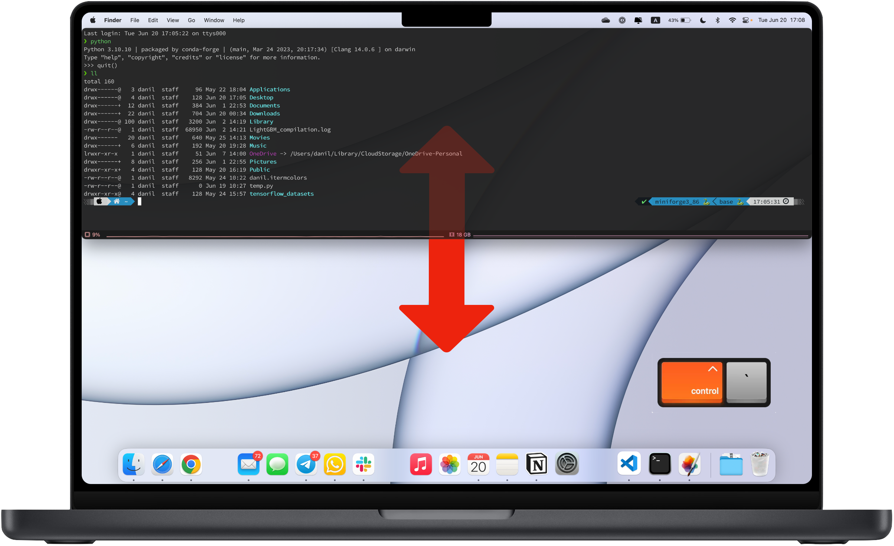

Ultimate Mac drop-down Quake-style terminal setup
=================================================
Below steps are in support of a YouTube video: link!!!!!

1. Install text editor. 
-----------------------
I prefer Visual Studio Code.
Just google it, download and install on your machine from the official web-site.

1. Create a .zshrc file
-----------------------
Check your home directory with finder, make sure to display hidden files with 'cmd+shift+.' command.
If you don't have .zshrc file in your home directory, create it with touch command in terminal.

.. code-block::

    touch ~/.zshrc

2. Install xcode developer tools.
----------------------------------
Required step for anything related to programming.

.. code-block::

    xcode-select --install
       
4. Install homebrew
-------------------
So-called missing package manager for MacOS or linux systems. It is just a convenient way to install many different development packages onto your machine.

For ARM macs:
    
    cd ~/Downloads
    mkdir homebrew
    curl -L https://github.com/Homebrew/brew/tarball/master | tar xz --strip 1 -C homebrew
    sudo mv homebrew /opt/homebrew

For intel macs:
       
    cd ~/Downloads
    mkdir homebrew
    curl -L https://github.com/Homebrew/brew/tarball/master | tar xz --strip 1 -C homebrew
    sudo mv homebrew /usr/local/homebrew

Add path to brew to your .zshrc file. Open it with your text editor and insert the following line at the end of the file:

.. code-block::
    caption: For ARM macs
    export PATH=//homebrew/bin:$PATH

.. code-block::
    caption: For intel macs
    export PATH=/usr/local/homebrew/bin:$PATH

1. Install iTerm2
-----------------
Alternative to a built in Terminal, but it is far more configurable, which we need to get this look and feel of a drop down console.

.. code-block::

    brew install --cask iterm2

4. Install oh-my-zsh theme
--------------------------
This is a theme for a terminal, which will make it look nice and add some useful features.

.. code-block::

    sh -c "$(curl -fsLS https://raw.githubusercontent.com/robbyrussell/oh-my-zsh/master/tools/install.sh)"

5. Install custom font
----------------------
5.1 In browser download font: https://github.com/Falkor/dotfiles/blob/master/fonts/SourceCodePro%2BPowerline%2BAwesome%2BRegular.ttf
5.2 Open 'font book' on a mac (search 'font book' in spotlight) and drag&drop this font from downloads folder.

6. Install powerline10k theme
-----------------------------
This theme will help us configure iTerm2 to display information in a convenient way.

.. code-block::

    git clone https://github.com/romkatv/powerlevel10k.git $ZSH_CUSTOM/themes/powerlevel10k

7. Configure iTerm2
-------------------
Working with iTerm2 settings.

7.1 Delete default profile
~~~~~~~~~~~~~~~~~~~~~~~~~~
    
iTerm2 Settings -> Profiles -> create new profile, set as default, delete the 'Default' profile
Delete default profile
iTerm2 Settings -> Profiles -> create new profile, set as default, delete the 'Default' profile

7.2 Configure colors
~~~~~~~~~~~~~~~~~~~~

Copy contents of danil.itermcolors file in this repo then save this create your own 'user.itermcolors' file in your home directory and paste the contents of danil.itermcolors file there.
iTerm2 Settings -> Profiles -> Colors -> Color Presets -> Import (and chose this user.itermcolors file in the home dir) -> after import in Color Presets select this 'user' color theme

7.3 Configure fonts
~~~~~~~~~~~~~~~~~~~~

iTerm2 Settings -> Profiles -> Text -> Font (find SourceCodePro+Powerline...) AND check the 'Use ligatures' checkbox AND increase fontsize to 14

7.4 Statusbar
~~~~~~~~~~~~~

iTerm2 Settings -> Profiles -> Session (check Status bar enabled) AND Configure Status Bar to display what you want. I use cpu + ram AND configure the Auto-Rainbow: Light Colors. Then select "Advanced" and change the background color (use color picker and pick color of iterm window)
Then go to Settings -> Appearance and change the 'Status bar location' to 'Bottom'.

7.5 Apply powerlevel10k
~~~~~~~~~~~~~~~~~~~~~~~~

Open .zshrc
Replace the ZSH_THEME="robbyrussell" with ZSH_THEME="powerlevel10k/powerlevel10k"
Restart terminal and it will pop up with configuration wizard: answer No to first (font) question then logically to all other questions about icons appearance on the screen. To set up as featured use following settings: -> Rainbow -> Unicode -> 24-hour format -> Angled -> Sharp -> Flat -> One Line -> Compact -> Many icons -> Concise -> Verbose -> Yes
You can always re-run this configuration by terminal command: p10k configure

8. Plugins for terminal
-----------------------

8.1 Autosuggestion plugin
~~~~~~~~~~~~~~~~~~~~~~~~~
This plugin will add the command autosuggestion to terminal which user can use with 'tab'

.. code-block::

    git clone https://github.com/zsh-users/zsh-autosuggestions ${ZSH_CUSTOM:-~/.oh-my-zsh/custom}/plugins/zsh-autosuggestions

Open .zshrc in the plugins variable (for now it should only include 'git') add zsh-autosuggestions !!! no comma between plugins in tuple.

8.2 yntax-highlighting
~~~~~~~~~~~~~~~~~~~~~~

.. code-block::

    https://github.com/zsh-users/zsh-syntax-highlighting.git ${ZSH_CUSTOM:-~/.oh-my-zsh/custom}/plugins/zsh-syntax-highlighting

Open .zshrc in the plugins variable add zsh-syntax-highlighting. At this step plugins variable should look like this: plugins=(git zsh-autosuggestions zsh-syntax-highlighting web-search)

8.3 Web-search from terminal with google command
~~~~~~~~~~~~~~~~~~~~~~~~~~~~~~~~~~~~~~~~~~~~~~~~

Open .zshrc and add web-search plugin to plugins variable: plugins=(git zsh-autosuggestions zsh-syntax-highlighting web-search)

1. Drop-down mode
-----------------
9.1 Configure shortcut 
~~~~~~~~~~~~~~~~~~~~~~
iTerm2 Settings -> Keys -> Hotkey -> Dedicated hotkey -> Ctrl+~ -> Check 'Floating Window'.

9.2 Further setup
~~~~~~~~~~~~~~~~~
iTerm2 Settings -> Profiles -> Window -> Space (All Spaces) AND Screen (Screen with Cursor) AND set Transparrency to 5 AND check 'Hide after opening'

9.3 Open at computer startup
~~~~~~~~~~~~~~~~~~~~~~~~~~~~~
With Spotlight open Users & Groups and add iTerm2 to login items.
Remove it from dock and Tab-Switcher menu: iTerm2 Settings -> Appearance -> check Exclude from Dock...

This way it will always be available by the Ctrl+~ shortcut and if you need the settings, use Cmd+, shortcut with console window opened

10. Other useful settings
-------------------------
Open .zshrc and add: alias ll='ls -lG'
This enables an 'll' terminal command.

